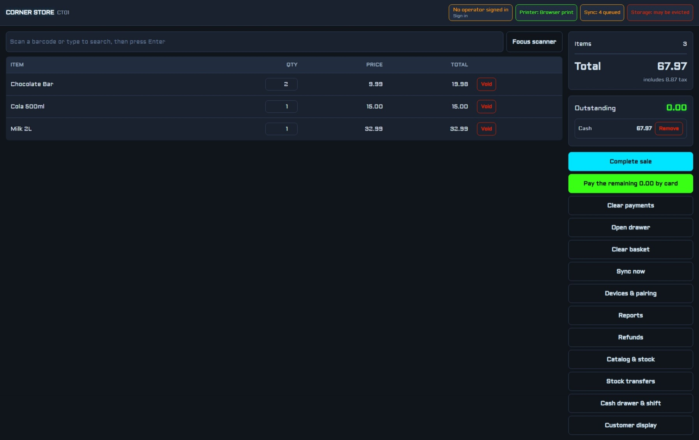

# SmartQ Blazor POS

[](LICENSE.md)
[](LICENSING.md)
[](https://dotnet.microsoft.com/)
[](https://blazor.net/)

**Author:** SmartQ (Pty) Ltd · **Copyright** © 2026 SmartQ (Pty) Ltd ·
**License:** AGPL-3.0 or commercial — see [LICENSING.md](LICENSING.md)

An offline-first, multi-store Point of Sale system built as a **Blazor WebAssembly PWA**,
with **WebUSB** as the preferred peripheral transport and graceful fallbacks for every
other browser.



See [`PLAN.md`](PLAN.md) for the full architecture, browser-support findings, and phased
delivery plan. See [`RELEASE-NOTES.md`](RELEASE-NOTES.md) for the detailed feature
history, verification evidence, and the defects found along the way.

---

## Status

| Phase | Scope | State |
|---|---|---|
| **0** | Solution skeleton, build/test gates | ✅ Complete |
| **1** | Checkout flow (scan → cart → tender → receipt → drawer) | ✅ Complete |
| **2** | Catalog & inventory | ✅ Complete |
| **3** | Payments, refunds, exchanges | 🚧 Split tender and the payment seam done; an integrated card terminal remains hardware |
| **4** | Employees, shifts, drawer counts, Z-reports | ✅ Complete |
| **5** | Multi-store, price lists, transfers, reporting | 🚧 Store register, head-office auth, consolidated estate reporting, per-store catalogue publishing, and stock transfers end to end on the till done and verified over HTTP; per-store price overrides and a head-office console remain |
| **6** | Sync service (server + consolidation) | 🚧 Ingest, pull, consolidated reporting and credential rotation verified over HTTP; change-log trimming remains |
| **7** | Hardening: AOT, trimming, performance, accessibility | 🚧 Accessibility done (89 structural checks over every screen, on every build); AOT, trimming, bundle budget and install UX remain |

**1094 tests passing, 0 failures, 0 build warnings** — every screen rendered in-process,
every pillar driven through the controls a shop actually uses, and the multi-store loop
verified against a running hub over HTTP. The full evidence is in
[`RELEASE-NOTES.md`](RELEASE-NOTES.md#verification-and-test-evidence).

### Out of scope for now: fiscal regimes

**No market requiring certified or fiscally-signed documents is targeted yet.** This is a
deliberate exclusion: a fiscal requirement changes the *shape* of the checkout transaction,
not just its paperwork, so it cannot be bolted on late. What it would cost, and why the
decision is stated now, is in [`RELEASE-NOTES.md`](RELEASE-NOTES.md#scope).

> **TODO:** pick the first target market and implement its regime end to end. Until then,
> treat every deployment as a jurisdiction with no fiscal requirement, and do not describe
> this system as compliant with any.

### Specification coverage

Checked against the requested feature list, item by item, with what is actually in the code rather
than what was intended:

| Requested | State |
|---|---|
| **Articles**: barcode | ✅ Primary barcode, scanned at the till, indexed per store |
| **Articles**: SKU | ✅ On the product, searchable, printed on shelf labels, carried in the CSV and over sync |
| **Articles**: name | ✅ |
| **Articles**: category / family | ✅ Free-text grouping, shown and editable on the catalogue screen |
| **Articles**: tax rate | ✅ Per article, overriding the store default |
| **Articles**: price | ✅ Shelf price, tax-inclusive or exclusive per store. Multi-price-level is explicitly later |
| **Articles**: stock-tracking flag | ✅ `TracksStock` — a decision, distinct from "has no movements yet" |
| **Reorder point** | ✅ Per article, per store; the list is derived from the movement ledger |
| **Catalogue maintenance, CSV import/export** | ✅ Excel-safe quoting, header matched by name, per-row errors with line numbers, re-import updates by barcode |
| **Sale documents**: lines, discounts, taxes, totals | ✅ Line and ticket discounts, per-rate tax, totals that reconcile |
| **Sale documents**: receipt numbering series | ✅ `CT01-20260325-0007`, allocated locally so an offline sale is complete |
| **Till sessions**: open/close, movements, X/Z | ✅ Open, close, cash in/out, no-sale openings with a reason, blind count, X and Z readings |
| **Payments**: cash, card abstraction, split tender, change | ✅ `IPaymentProvider` seam with a record-only implementation; split tender; change given |
| **Receipts**: ESC/POS, reprint | ✅ Byte-exact ESC/POS, plus a browser-print fallback for Safari and Firefox |
| **Receipts**: PDF / email | ❌ **Not built.** The browser-print path can save a PDF through the OS print dialog, but nothing generates a PDF file and nothing sends email |
| **Customers**, optional on a sale | ⚠️ **Seam only.** `Sale.CustomerId` exists and is carried through storage and sync; there is no customer master, no screen to attach one, and no lookup at the till |
| **Returns / refunds** | ✅ Full and partial returns, per-line selection, refund authority, stock returned to the shelf |
| **Users / roles** | ✅ Cashier and manager permissions, enforced in the service rather than only in the screen |
| **Reports**: by period | ✅ 7/14/30/90 days or a range, with the equivalent previous period alongside |
| **Reports**: by article | ✅ Top sellers by revenue, and per-product tax |
| **Reports**: by cashier | ✅ Per-operator takings, sale count and discount given, named from the roster |
| **Reports**: stock levels | ✅ Derived levels with the movement count behind them, plus the reorder list |
| **Reports**: tax summary | ✅ Net and tax per rate, reconciling with the report's own tax total |

The two gaps are named rather than glossed: **receipts by PDF or email**, and **customers**. Both are
additive — neither changes the shape of a sale — so they can be built without reopening the checkout
path, which is not true of the fiscal regimes above.

### Peripheral support

| Device | State |
|---|---|
| 58/80mm ESC/POS receipt printer | ✅ WebUSB, Web Serial, browser print, simulated |
| Cash drawer kick-out | ✅ Via ESC/POS `ESC p` on the transports that support it |
| Kitchen / bar printer | ✅ A second, independently paired device, fed by station routing |
| ZPL label printer | ✅ A third paired device; shelf labels printed from the catalogue screen |
| Customer-facing display | ✅ Second window on `/display`, driven over `BroadcastChannel` |
| Web Bluetooth printer | ⬜ Not started |

### Screens

| Route | Purpose |
|---|---|
| `/` | The till: scan, basket, tender, print, sync |
| `/signin` | Choose an operator, enter a PIN, open the drawer |
| `/shift` | The drawer: activity, no-sale openings, cash in/out, blind count, Z close |
| `/catalog` | Products, prices, derived stock levels, and the movement ledger behind them |
| `/reports` | X and Z readings, takings, top sellers, hourly chart |
| `/refunds` | Find a sale, choose what is coming back, refund and print a slip |
| `/devices` | Pair a printer, enrol the terminal, inspect browser capabilities |
| `/display` | Customer-facing second screen — open it from the till |

---

## Running the till

```powershell
# Terminal UI (serves on http://localhost:5043)
dotnet run --project .\src\Pos.Web\Pos.Web.csproj

# Sync hub (serves its own API; host the published PWA here for one HTTPS origin)
$env:HeadOffice__Token = '<at least 32 characters>'
dotnet run --project .\src\Pos.Sync.Server\Pos.Sync.Server.csproj
```

The hub needs `HeadOffice__Token` before it will provision a store or enrol a terminal. Without it
the API still runs and terminals still sync, but every head-office endpoint refuses — including
`POST /api/enrollment/stores`, so a fresh hub cannot enrol its first till until it is set. Generate
one with `HeadOfficeCredential.NewToken()`.

```powershell
# Prove the multi-store loop end to end against a live hub: two stores, the head-office
# boundary, a refund and a void in the estate total, and catalogue isolation.
pwsh -File tools\verify-head-office.ps1
```

WebUSB requires **HTTPS or localhost**, so the till works on `localhost` for development
and needs a TLS origin in production — which is exactly why the hub hosts the PWA itself.

### Verified in a real browser

The till was driven in headless Edge over the DevTools protocol. It renders, initialises
storage, seeds a demo catalogue, and resolves a printer:

```
CORNER STORE | CT01 | Printer: Simulated printer | Sync: all sent | Storage: may be evicted
warn: TerminalStartup[1000] Durable storage was not granted...
info: TerminalStartup[1001] Seeded 8 demo products into an empty catalogue.
info: TerminalPrinterProvider[1003] Printer resolved: Simulated printer (Ready).
```

That run found two defects a clean build could not: an **ambiguous route** (the template's
`Home.razor` also claimed `@page "/"`) and a **deadlocking synchronous wait** on async
device resolution. Both are described in `PLAN.md`.

---

## Layout

```
POS/
├─ Pos.slnx                      Solution (new XML format)
├─ Directory.Build.props         Shared: net10.0, nullable, analyzers
├─ NuGet.config                  Pinned to nuget.org for reproducible restore
├─ src/
│  ├─ Pos.Core/                  PURE domain — no browser or storage dependencies
│  │  └─ Domain/                 Money, TaxRate/TaxMode, TaxEngine, Cart, Sale, Tender
│  ├─ Pos.Devices/               Peripheral protocol + transports
│  │  ├─ EscPos/                 EscPosBuilder, Cp437, ReceiptRenderer, PrinterResolver
│  │  └─ Transport/              IDeviceTransport, WebUSB, Simulated, JS bridge
│  ├─ Pos.Infrastructure/        Persistence, checkout recording, sync contracts
│  │  ├─ Storage/                ILocalStore, records, mapper, in-memory implementation
│  │  ├─ Checkout/               CheckoutRecordingService, trading-day reporting
│  │  └─ Sync/                   Wire contracts shared by terminal and hub
│  ├─ Pos.Sync.Server/           ASP.NET Core hub: enrolment, push/pull, static host
│  │  ├─ Data/                   EF Core entities and DbContext
│  │  ├─ Auth/                   Device credential generation and hashing
│  │  └─ Endpoints/              Sync and enrolment endpoints
│  └─ Pos.Web/                   Blazor WASM PWA (the till UI)
│     └─ wwwroot/js/             device-bridge.js (WebUSB), local-store.js (IndexedDB)
└─ tests/
   ├─ Pos.Core.Tests/
   ├─ Pos.Devices.Tests/
   ├─ Pos.Infrastructure.Tests/
   └─ Pos.Sync.Server.Tests/
```

### Why the layering matters

`Pos.Core` has **zero** browser, storage, or UI dependencies. Cart arithmetic, tax
extraction, discount allocation, and tender validation are therefore fully unit-testable
without a browser. `Pos.Devices` *builds* ESC/POS bytes in pure C#; only moving those
bytes onto the wire touches JavaScript. That split keeps the risky logic testable and
leaves the browser shim with almost nothing to get wrong.

---

## Building and testing

Standard .NET 10 toolchain — no special setup:

```powershell
dotnet build .\Pos.slnx -c Release
dotnet test  .\Pos.slnx -c Release
```

---

## Design decisions worth knowing

| Decision | Rationale |
|---|---|
| `decimal` for all money, banker's rounding | `double` cannot represent `0.10` exactly, and errors accumulate until the receipt disagrees with its own lines. Banker's rounding avoids a systematic upward bias across thousands of sales. |
| Tax assessed **per rate group**, not per line | Per-line rounding then summing drifts from the correctly computed basket total. Tax authorities assess on the invoice total. |
| Order discount allocated **proportionally**, remainder to the largest line | Guarantees the allocated shares sum exactly to the discount, so no cent vanishes and the receipt reconciles. |
| Sale lines snapshot price, name, and tax rate | A later catalogue edit must never change a historical receipt. |
| Voids set a status, never delete | A deleted sale is a vanished audit trail; a POS without an audit trail cannot be reconciled. |
| UUIDv7 identifiers | Time-ordered, so records sort chronologically and index inserts stay sequential. Generated on the terminal, so offline sales stay unique. |
| Hand-written CP437 table | Code page 437 is unavailable in .NET without a native-dependent package that is a poor fit for Blazor WASM. ~220 mappings, deterministic, byte-assertable. |
| `TwoColumns` pads by **CP437-encoded** width | The printer advances bytes, not Unicode cells: `日本語` is 3 printed cells (`???`), not 6. Measuring Unicode width misaligns every amount. |
| Store scoping (`StoreId`) from day one | Retrofitting tenancy later touches every query, table, and receipt. |
| Record-only tender, no card data | Keeps the system out of PCI DSS scope by construction. |

The reasoning behind the wider design — refunds as append-only records, the blind cash
count, two-event stock transfers, credential rotation, printer-role binding, and the
defects that shaped them — is in [`RELEASE-NOTES.md`](RELEASE-NOTES.md).

### Browser & protocol constraints (verified)

- **WebUSB is Chromium-only** (Chrome 61+, Edge 79+, Opera 48+, Samsung Internet 8.2+).
  Safari never shipped it, and Firefox's official standards position is *"harmful"*.
  It is therefore **one transport adapter**, never the foundation.
- `navigator.usb.requestDevice()` requires **HTTPS and a user gesture**. A Blazor `async`
  handler that `await`s has already lost the gesture, so pairing uses synchronous
  `IJSInProcessRuntime` interop.
- `navigator.usb.getDevices()` re-acquires already-authorised devices **without a prompt**,
  so a terminal reconnects its printer after a one-time pairing.
- Most handheld scanners use **HID keyboard-emulation**, which works in every browser with
  no API at all. `WebHID` is a Chromium-only enhancement, not a requirement.

---

## Accessibility

Every screen passes **89 structural accessibility checks on every build** — every control
has a name, every table has named header cells, every screen has exactly one `h1`, and
every live region is empty on first render so announcements actually fire. The findings,
the judgement calls, and what is deliberately not covered are in
[`RELEASE-NOTES.md`](RELEASE-NOTES.md#accessibility).

---

## License

Copyright © 2026 **SmartQ (Pty) Ltd**. All rights reserved.

SmartQ Blazor POS is **dual-licensed**:

- **Open source:** [GNU Affero General Public License v3](LICENSE.md) (AGPL-3.0) —
  free to use, modify and redistribute under copyleft terms, including source
  disclosure for network-deployed modifications.
- **Commercial:** a proprietary license from SmartQ (Pty) Ltd for closed-source,
  white-label or hosted use without AGPL obligations.

See [LICENSING.md](LICENSING.md) for how to choose and how to obtain a commercial
license. "SmartQ" and "SmartQ Blazor POS" are trade names of SmartQ (Pty) Ltd and
are not licensed for use by derivative works.
